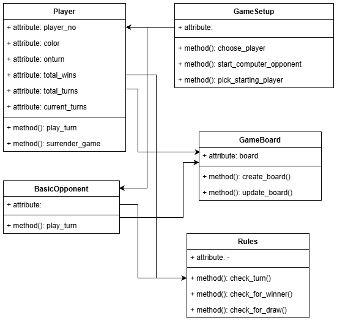

# Documentation Planning Implemetation
Before programming the game, it was decided which classes, methods and attributes will most likely be needed.  
All classes, methods and attributres are also named in the respective Github issues.

## Initial structure
<!-- insert class diagram -->

The necessary parts for the game were divided in individual classes. Required attributes and methods are mapped in the diagram. As the diagram only shows the first idea, the relations and structure in the finished game may differ from the original structure.

## Changes while implemenation

### Rules are included in GameBoard class
While implementing it was decided to add the methods of the planned Rules class into the GameBoard class. This was decided because it makes more sense as the GameBoard class does hold the data and state of the board. If someone checks in real life e.g. for winner or valid turn, they also look at the board to get the answer.
